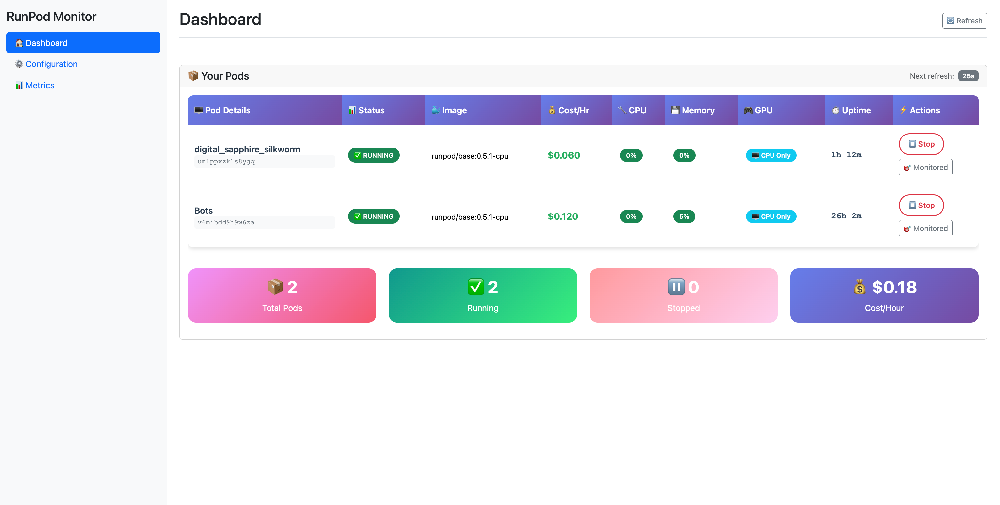

# 🚀 RunPod Monitor

Monitor and auto-manage your RunPod instances with a simple web interface.

----
Runpod Image:
https://console.runpod.io/deploy?template=xe00ihiurd&ref=p1oqnqy1
----

## ⚡ Quick Start

### 1. Clone & Setup
```bash
git clone <repository>
cd RunpodMonitor
echo "RUNPOD_API_KEY=your_api_key_here" > .env
```

### 2. Start Server
```bash
python server.py
```

### 3. Open Browser
```
http://localhost:8080
```

**That's it!** 🎉

## 📸 Screenshots

### Home Dashboard

*Main dashboard showing pod status, actions, and real-time monitoring*

### Configuration Page  

*Auto-stop settings, thresholds, and exclusion management*

### Metrics & Data

*Historical data, usage graphs, and filterable pod metrics*

## Exclude Pods
On the home page, you'll see if something is excluded or not. Click the "Monitor" button or the "Exclude" button to switch it to actually shut off or to exclude it from monitoring.

## 🐳 Docker (Secure & Easy)

```bash
# Build
docker build -t runpod-monitor .

# Run with API key from environment
docker run -d \
  -p 8080:8080 \
  -e RUNPOD_API_KEY=your_api_key_here \
  -v $(pwd)/data:/app/data \
  runpod-monitor
```

## 📊 Features

- **Real-time monitoring** - See CPU, GPU, memory usage live with automatic data collection
- **Auto-stop idle pods** - Save money by stopping unused pods automatically
- **Web dashboard** - Modern interface with live updates and HTMX-powered interactions
- **One-click actions** - Start/stop pods instantly with dynamic button switching
- **Historical metrics** - Track usage over time with detailed pod statistics
- **Smart filtering** - Only shows active pods with automatic cleanup
- **Filterable raw data** - Click pod buttons to filter data table by specific pods
- **Exclude/include management** - Real-time pod exclusion with instant UI updates
- **Live collection status** - See exactly when next data collection will occur

## ⚙️ Configuration

The server starts with sensible defaults. To customize:

1. **Edit `config.yaml`** for detailed settings
2. **Use the web interface** - Go to Config page for real-time changes
3. **Environment variables** - Set `RUNPOD_API_KEY` and other options

### Auto-Stop Settings (via Web UI)
- **CPU/GPU/Memory thresholds** - Set limits (e.g., ≤5% usage)
- **Duration** - How long conditions must persist (e.g., 45 minutes)
- **No-change detection** - Stop completely idle pods
- **Exclude pods** - Protect critical workloads

## 🔧 Development

### Manual Installation
```bash
pip install uv
uv pip install .
python server.py
```

### CLI Mode (Optional)
```bash
# Interactive mode
python -m runpod_monitor.main

# Monitoring only (no web UI)
python -m runpod_monitor.main --monitor

# List pods
python -m runpod_monitor.main --action list
```

## 🌟 What You Get

### Web Dashboard
- 📦 **Pod Overview** - Current status of all pods with exclude/include buttons
- 🔄 **Live Updates** - Real-time status every 5 seconds with accurate monitoring detection
- 📊 **Metrics History** - Usage graphs and statistics with filterable raw data table
- ⚙️ **Configuration** - Change settings via web interface with instant updates
- 🎯 **Actions** - Start/stop pods with dynamic button switching
- ⏰ **Collection Status** - Simple text showing next data collection time

### Smart Monitoring
- **Background data collection** - Simple monitoring loop starts immediately with server
- **Active pods only** - Ignores terminated/deleted pods with automatic cleanup
- **Excluded pod handling** - Completely stops data collection and removes existing data for excluded pods
- **Real-time monitoring detection** - UI accurately shows monitoring status based on recent data
- **Rolling window** - Manages memory usage efficiently

### Auto-Stop Features
- **Threshold monitoring** - CPU, GPU, memory limits
- **Duration-based** - Must meet conditions for specified time
- **No-change detection** - Stops completely idle workloads
- **Exclude lists** - Protect critical pods with automatic cleanup
- **Real-time control** - Enable/disable via web interface
- **Stop command timing** - After a pod is identified for stopping, allow 2-3 more data collection cycles (2-3 minutes) for the stop command to take effect before re-triggering

## 🚀 Production Tips

1. **Set your API key**: `export RUNPOD_API_KEY=your_key`
2. **Configure auto-stop**: Use the web interface Config page
3. **Monitor safely**: Start with high thresholds, then tune down
4. **Exclude critical pods**: Add important workloads to exclude list (auto-cleaned when pods no longer exist)
5. **Check logs**: Watch for auto-stop actions
6. **Stop command timing**: When a pod meets auto-stop criteria, the system issues a stop command but continues monitoring. Allow 2-3 data collection cycles (2-3 minutes) for the API stop command to take effect before expecting the pod status to change to EXITED

## 📚 API Reference

The server exposes a REST API at `http://localhost:8080`:

### Pages
- `GET /` - Dashboard page
- `GET /pods` - Live pod list (HTMX)
- `GET /metrics` - Metrics page with live updates and filterable data
- `GET /config` - Configuration page

### Pod Actions
- `POST /pods/{pod_id}/stop` - Stop a pod with dynamic button update
- `POST /pods/{pod_id}/resume` - Resume a pod with dynamic button update
- `POST /pods/{pod_id}/exclude` - Add pod to exclude list
- `POST /pods/{pod_id}/include` - Remove pod from exclude list

### Configuration
- `POST /config/auto-stop` - Update basic auto-stop settings
- `POST /config/no-change` - Update no-change detection
- `POST /config/sampling` - Update sampling configuration

### API Endpoints
- `GET /api/monitoring-status` - Live monitoring status (HTML)
- `GET /api/next-poll` - Next collection time and monitoring status (JSON)
- `GET /api/raw-data?pod_filter={name}` - Filterable raw data table (HTML)
- `GET /status` - System status (JSON)

## 🛡️ Security

- **API Keys**: Store in environment variables, never commit to code
- **Exclude Lists**: Protect production workloads from auto-stop
- **Testing**: Verify thresholds on non-critical pods first
- **Monitoring**: Watch logs for unexpected auto-stop actions

---

**Need help?** Check the web interface tooltips or submit an issue!