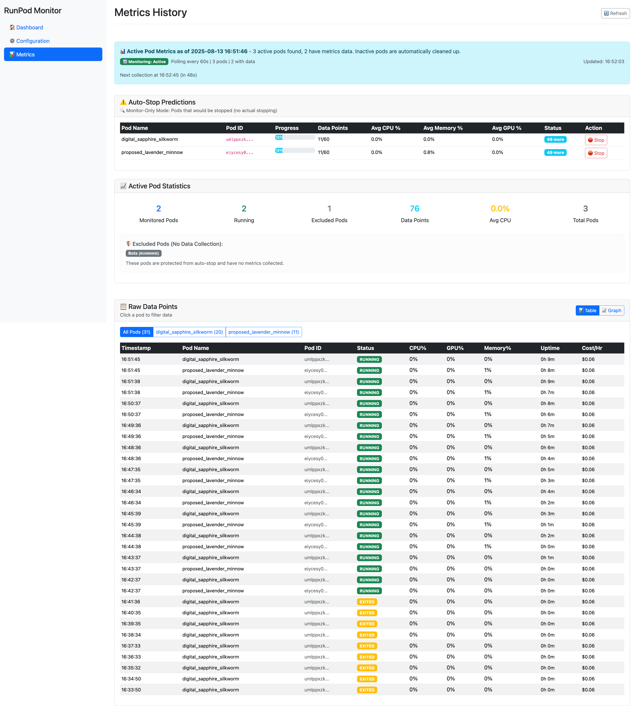

# 🚀 RunPod Monitor

Monitor and auto-manage your RunPod instances with a simple web interface.


## Version
1.0: JSON based file
2.0: Data Migration + Hooks + Data compaction for graphs
2.1: Attempt to fix hanging code on startup server
2.2: Beta Version of Better Memory Management
2.3: Data Clean Up for non-existing pods

----

## 🆕 Self-Contained Pod Monitor

For a portable version where the pod monitors itself (rather than organization-level monitoring), check out:

**📁 Directory:** [`./self-contained/`](./self-contained/)

### Quick Start - One Line Installation

Inside your RunPod pod terminal, run:

```bash
apt-get update && apt-get install -y tmux curl && curl -sSL https://raw.githubusercontent.com/justinwlin/Runpod-Idle-Pod-Monitor/refs/heads/main/self-contained/quick_install.sh -o /tmp/quick_install.sh && chmod +x /tmp/quick_install.sh && /tmp/quick_install.sh
```

This command will:
- Install tmux for persistent session management
- Download and run the monitoring script
- Guide you through configuration (CPU/GPU/Memory thresholds)
- Start monitoring in a tmux session that survives SSH disconnections
- Automatically stop your pod when idle (optional)

### Features
- ✅ No external dependencies - runs entirely within your pod
- ✅ Survives SSH disconnections using tmux
- ✅ Monitor-only mode for testing thresholds
- ✅ Auto-stop mode to save money
- ✅ Simple threshold configuration
- ✅ Real-time resource monitoring

### After Installation
- **Detach from monitor:** `Ctrl+B` then `D`
- **Reattach to monitor:** `tmux attach -t monitor`
- **Check status:** `cat /tmp/monitor_counter.json`
- **View help:** `cat /tmp/TMUX_HELP.md`

See [self-contained README](./self-contained/README.md) for detailed instructions.

----

## 🖥️ Organization-Level Monitor (Web Dashboard)

Runpod Image:
https://console.runpod.io/deploy?template=xe00ihiurd&ref=p1oqnqy1

**IF YOU DEPLOY THIS ON RUNPOD** MAKE SURE TO EXCLUDE THE POD YOU ARE RUNNING THIS ON FROM THE MONITORING. There is an "Monitoring" Button on the home page for the pod, which when you click it will switch it to the exclude list.

Recommended: Run this on the cheapest CPU Pod

Docker Image Recommended version currently, if you self deploy / run it not on Runpod, make sure to set the .env file. In Runpod Pods, the ENV already has an API key injected so there is no need to manually set it.
```
docker.io/justinrunpod/runpodidlemonitor:2.3
```

----

## ⚡ Quick Start

### 🏃‍♂️ Running on RunPod (Recommended)
Just click the Runpod image template, and start it on the lowest CPU pod.

**That's it!** 🎉 The `RUNPOD_API_KEY` environment variable is pre-configured.

### 💻 Running Locally

#### 1. Clone & Setup
```bash
git clone <repository>
cd RunpodMonitor
echo "RUNPOD_API_KEY=your_api_key_here" > .env
```

#### 2. Start Server
```bash
python server.py
```

#### 3. Open Browser
```
http://localhost:8080
```

## 📸 Screenshots

### Home Dashboard

*Main dashboard showing pod status, actions, and real-time monitoring*

### Configuration Page  

*Auto-stop settings, thresholds, and exclusion management*

### Metrics & Data



*Historical data, usage graphs, and filterable pod metrics*

### Network Storage Pod - Paused State

*Example of a network storage pod in paused state - data preserved, can be resumed*

## Exclude Pods
On the home page, you'll see if something is excluded or not. Click the "Monitor" button or the "Exclude" button to switch it to actually shut off or to exclude it from monitoring.

## 🐳 Docker (Secure & Easy)

```bash
# Build
docker build -t runpod-monitor .

# Run with API key from environment
docker run -d \
  -p 8080:8080 \
  -e RUNPOD_API_KEY=your_api_key_here \
  -v $(pwd)/data:/app/data \
  runpod-monitor
```
## ⚙️ Configuration

The server starts with sensible defaults. To customize:

### Options:
2. **Use the web interface** - Go to Config page for real-time changes. The changes get persisted to the file on the server, so you can turn the server on and off, as long the file is not destroyed.
3. **Environment variables** - `RUNPOD_API_KEY` is auto-configured on RunPod when you start a container is already in the env. But you can also set it manually locally by creating a .env file with the key.

### Recommendations:
Just use the Web UI for configurations since it will autopersist into whatever file, and will create a starting configuration file if it doesn't exist based off the yaml template.

### Auto-Stop Settings (via Web UI)
- **CPU/GPU/Memory thresholds** - Set limits (e.g., ≤5% usage)
- **Duration** - How long conditions must persist (e.g., 45 minutes)
- **No-change detection** - Stop completely idle pods
- **Exclude pods** - Protect critical workloads

## 🔧 Development

### Manual Installation
```bash
pip install uv
uv pip install .
python server.py
```